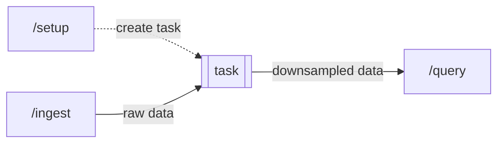

# Boilerplate Application

A basic application to help you get started writing an application against InfluxDB 
using the [Go client](https://github.com/influxdata/influxdb-client-go).

The following environment variables are required to be set:
- `INFLUXDB_ORGANIZATION` - The name of your organization
- `INFLUXDB_HOST` - The hostname of the InfluxDB instance or Cloud environment you are using
- `INFLUXDB_TOKEN` - A token with read permissions to the bucket specified in `INFLUXDB_BUCKET`
- `INFLUXDB_BUCKET` - The name of your bucket

This application provides the ability to write data for its users, setup tasks to 
downsample their data, and query that downsampled data.



From this directory with the environment variables above set in scope, run the application
with `go run main.go` to start the application listening on port 8080.

- Verify the application is running by navigating to `http://localhost:8080` in your browser to see a welcome message.

- `POST` a request to the `/setup` endpoint to install a downsampling task for the specified user.
  
  ```
  {
    "user_id":"user1",
  }
  ```

- `POST` a request to the `/ingest` endpoint to write data for the specified.
  
  ```
  {
    "user_id":"user1", 
    "measurement":"measurement1",
    "field1":10002
  }
  ```
  
  
- `POST` a request to the `/query` endpoint to receive the latest data for the specified user.
  
  ```
  {
    "user_id":"user1",
  }
  ```
  
  The response is formatted as JSON.
  
  ```
  {
    "tables": [
    {
      "records": [
      {
        "_field": "field1_min",
        "_measurement": "downsampled",
        "_start": "2022-05-20 03",
        "_stop": "2022-05-21 03",
        "_time": "2022-05-21 03",
        "_value": "1",
        "result": "_result",
        "table": "0",
        "user_id": "user1"
      },
      {
        "_field": "field1_max",
        "_measurement": "downsampled",
        "_start": "2022-05-20 03",
        "_stop": "2022-05-21 03",
        "_time": "2022-05-21 03",
        "_value": "75",
        "result": "_result",
        "table": "1",
        "user_id": "user1"
      },
      {
        "_field": "field1_mean",
        "_measurement": "downsampled",
        "_start": "2022-05-20 03",
        "_stop": "2022-05-21 03",
        "_time": "2022-05-21 03",
        "_value": "14.272727272727273",
        "result": "_result",
        "table": "2",
        "user_id": "user1"
      }]
    }]
  }
  ```
  
